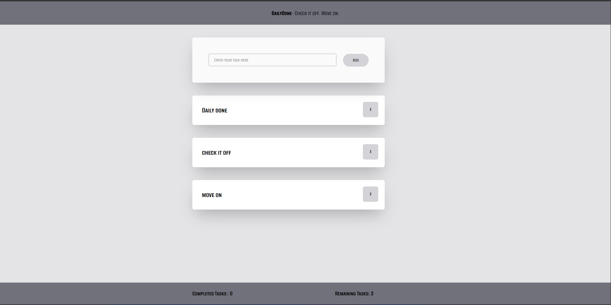
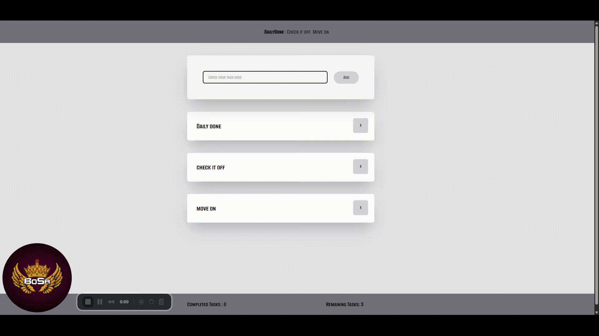

# DailyDone

**DailyDone** is a minimalist to-do app built with **ReactJS**, **Vite**, and **Tailwind CSS**. It was created as a practice project to learn and apply modern frontend development tools. The app focuses on clean design and essential functionality to help users track and complete daily tasks.

> *"Get it done. Every day."*

---

## Tech Stack

- **ReactJS** – UI library
- **Vite** – Fast development build tool
- **Tailwind CSS** – Utility-first CSS framework

---

## Features

- Add and delete tasks
- Mark tasks as complete
- Clear completed tasks
- Simple, responsive design

---

## Getting Started

### 1. Clone the repository

```bash
git clone https://github.com/sidharthpandithar/dailydone.git
cd dailydone
```

### 2. Install dependencies

```bash
npm install
```

### 3. Start development server

```bash
npm run dev
```

### 4. Build for production

```bash
npm run build
```

---

## Project Structure

```
/src
  /components     // Reusable React components
  /styles         // Tailwind and custom CSS
  App.jsx         // Main App component
  main.jsx        // Entry point
```

---

## Preview






## Purpose

This project was built to practice:
- Using **React** functional components and hooks
- Setting up projects with **Vite**
- Styling with **Tailwind CSS**

---

## License

This project is open source and available under the [MIT License](LICENSE).

---

## Author

Made with ❤️ by [Sidharth Pandithar](https://github.com/sidharthpandithar)
